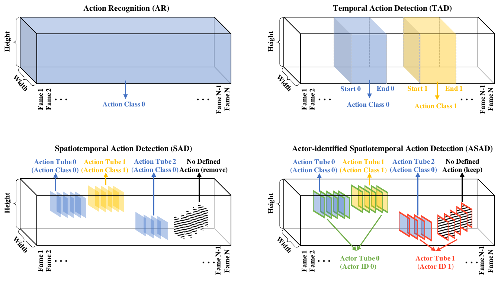
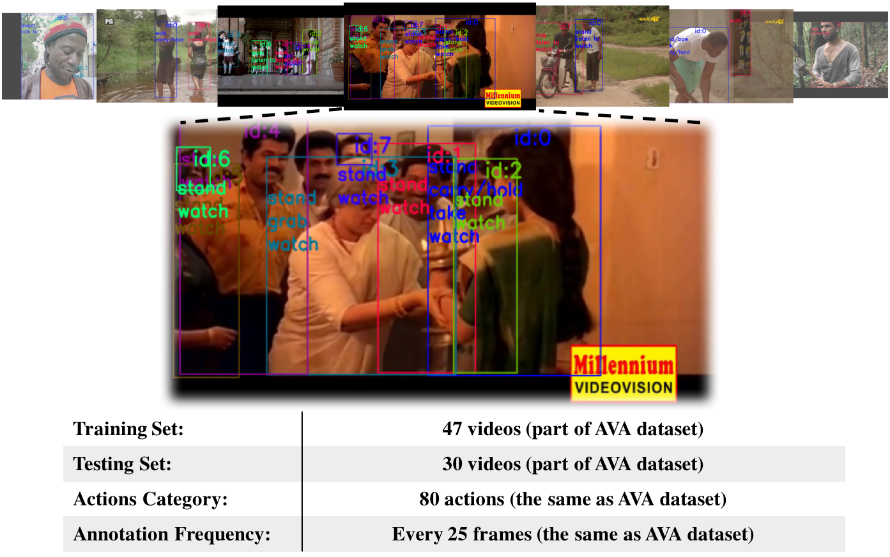

# Actor-identified Spatiotemporal Action Detection (ASAD)

The success of deep learning on video Action Recognition (AR) has motivated researchers to progressively promote related tasks from the coarse level to the fine-grained level. Compared with conventional AR that only predicts an action label for the entire video, Temporal Action Detection (TAD) has been investigated for estimating the start and end time for each action in videos. Taking TAD a step further, Spatiotemporal Action Detection (SAD) has been studied for localizing the action both spatially and temporally in videos. However, who performs the action, is generally ignored in SAD, while identifying the actor could also be important. To this end, we propose a novel task, Actor-identified Spatiotemporal Action Detection (ASAD), to bridge the gap between SAD and actor identification.
<p align="center">
  
</p>


## A-AVA Datasets

We create a new A-AVA dataset based on existing [AVA dataset](http://research.google.com/ava/) and the [TAO dataset](https://taodataset.org/), by assigning the unique actor identity and actions to each actor.

<p align="center">
  
</p>


### A-AVA Dataset Download

Our A-AVA dataset is extended from the [AVA dataset](http://research.google.com/ava/) and the [TAO dataset](https://taodataset.org/). For more details and copyrights, please refer to their webpages.

You can download our A-AVA dataset from 
[Download](https://drive.google.com/file/d/19p84A5rZUGtExpWnwLVc7n4sgypvITIt/view?usp=sharing)

### A-AVA Dataset Structure
After donwloading A-AVA dataset, you can unzip it to generate following data.
```
AVA/
|-- action_anno_train.pickle
|-- action_anno_val.pickle
|-- train
|   |-- AVA
|   |   |-- 5BDj0ow5hnA_scene_13_61290-62898
|   |   |   |-- frame0301.jpg   
|-- val
|   |-- AVA
|   |   |-- 7YpF6DntOYw_scene_3_32470-33281
|   |   |   |-- frame0001.jpg   
```

The A-AVA dataset annotation has the following structures:
```
action_anno_val = {1230(video id):
                {'video_info': 
                                {'video_id': 1230,
                                'width': 1280,
                                'height': 720,
                                'video_path': 'val/AVA/keUOiCcHtoQ_scene_28_124948-125707'
                                },
                    'img_info':
                                {47560 (image id):  
                                    {'img_path': 'val/AVA/keUOiCcHtoQ_scene_28_124948-125707/frame0051.jpg',
                                    'frame': 50},
                                ...
                                }
                    'obj_info':
                                {47560 (image id): 
                                    {0 (object id): 
                                        {'bbox': (154, 79, 341, 281), 
                                        'image_id': 47560, 
                                        'action': [14]},
                                    ...}
                                ...}
                }
        ...
        }
```

To do the evaluation, the output should have the same format as the above example. Make your result as action_pred_val.pickle and put it under A-AVA folder.

## Quantitative evaluation

We provide the evaluation scripts. Which can be run by

```
python run_evaluation.py \
--pred_file A-AVA/action_pred_val.pickle \
--true_file A-AVA/action_anno_val.pickle
```

The results will be illustrated as
```
mAP@.50IoU: xxx,  IDF1: xxx,   MT: xxx, ML: xxx, ID s.w.: xxx,   HL: xxx
```

## Citation
```
@article{yang2022actoridentified,
  title   = {Actor-identified Spatiotemporal Action Detection - Detecting Who Is Doing What in Videos},
  author  = {Fan Yang and Norimichi Ukita and Sakriani Sakti and Satoshi Nakamura},
  year    = {2022},
  journal = {arXiv preprint arXiv: Arxiv-2208.12940}
}
```

<a name="license"></a>
## License
This project is licensed under the MIT License - see the [LICENSE](LICENSE) file for details
